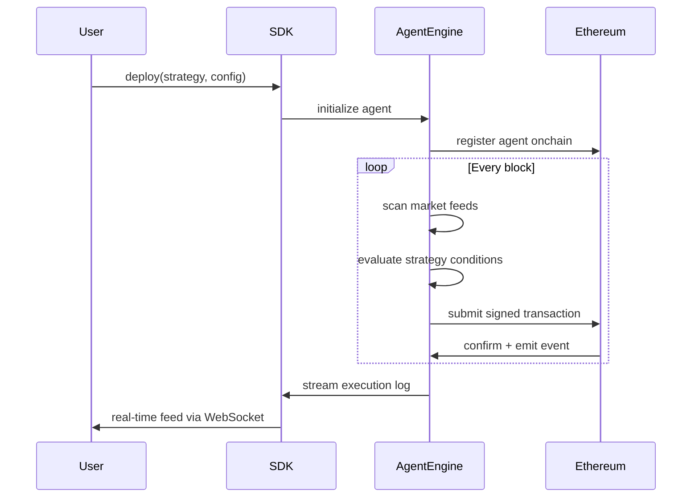

# NEXUS

Autonomous AI agent infrastructure for Ethereum. NEXUS enables developers and traders to deploy intelligent agents that execute DeFi strategies onchain with full verifiability and self-custodial guarantees.

[](LICENSE)
[](https://ethereum.org)
[]()

> **This project is in active development.** The SDK, API, and smart contracts are not yet deployed or published. This repository contains the protocol design and initial implementation.

---

## Overview

NEXUS sits between user intent and Ethereum execution. You define a strategy. The agent engine evaluates it every block, signs transactions from your delegated key, and settles everything onchain. No custodian. No trusted backend. The smart contract is the authority.

```
┌──────────────────────────────────────────────────────────────────────┐
│                              NEXUS                                   │
│                                                                      │
│   User Intent            Agent Engine              Ethereum          │
│  ┌───────────┐          ┌─────────────┐           ┌────────────┐     │
│  │ SDK  /    │  deploy  │  Strategy   │  signed   │  Smart     │     │
│  │ REST API  │─────────>│  Runtime    │──────────>│  Contract  │     │
│  └───────────┘          └──────┬──────┘           └─────┬──────┘     │
│                                │                         │           │
│                         ┌──────▼──────┐          ┌──────▼──────┐     │
│                         │  Market     │          │  On-Chain   │     │
│                         │  Feed       │          │  Verifier   │     │
│                         └─────────────┘          └─────────────┘     │
└──────────────────────────────────────────────────────────────────────┘
```

---

## How it works

An agent is a persistent process that monitors market conditions and submits transactions based on a configured strategy. Every action is signed by a key you control and verified by a smart contract you own. NEXUS never holds funds.



---

## Agent lifecycle

Each agent moves through a defined lifecycle from deployment to termination. State transitions are recorded onchain.

```
  deploy()          condition met       tx confirmed        stop() / threshold
     │                    │                  │                      │
     ▼                    ▼                  ▼                      ▼
┌──────────┐       ┌──────────┐       ┌──────────┐          ┌──────────┐
│ PENDING  │──────>│ WATCHING │──────>│ EXECUTING│──────────>│ STOPPED  │
└──────────┘       └──────────┘       └──────────┘          └──────────┘
                        │                  │
                        │   no condition   │   tx reverted
                        └──────────────────┘
                              (loop)
```

| State | Description |
|---|---|
| `PENDING` | Agent registered onchain, awaiting first evaluation cycle |
| `WATCHING` | Actively monitoring feeds, no condition met yet |
| `EXECUTING` | Transaction submitted and pending confirmation |
| `STOPPED` | Agent halted, either manually or by a stop condition |

---

## Agent types

| Agent | Strategy | Description |
|---|---|---|
| `yield_optimizer` | Passive | Scans Uniswap, Aave, and Lido pools and routes capital to the highest APY |
| `arb_trader` | Active | Executes MEV-protected arbitrage across DEXs via Flashbots bundles |
| `lp_manager` | Passive | Manages concentrated Uniswap v3 liquidity positions and rebalances on drift |
| `sentinel` | Guard | Monitors collateral ratios and auto-deleverages before liquidation thresholds |

### yield_optimizer

Continuously scans lending and liquidity protocols for the best yield on a given asset. When a better rate is detected above a configured threshold, the agent migrates the position automatically.

```
  Aave (3.1% APY) ──┐
  Lido (3.8% APY) ──┼──> evaluate() ──> route to highest ──> sign + submit
  Uniswap (4.2%) ───┘
```

### arb_trader

Monitors price discrepancies across DEXs. When a profitable spread is identified after gas costs, the agent constructs and submits a Flashbots bundle to protect against frontrunning.

```
  Uniswap price: 1820 USDC/ETH
  Curve price:   1834 USDC/ETH
                       │
               spread > min_profit_bps
                       │
               build Flashbots bundle
                       │
               submit to block builder
```

### lp_manager

Tracks the active price range of a Uniswap v3 position. When price drifts outside the configured band, the agent removes liquidity, adjusts the range, and re-enters.

### sentinel

Monitors a wallet's health factor across Aave or Compound. If the health factor drops below a configured floor, the agent repays debt or adds collateral to prevent liquidation.

---

## Architecture

```
┌────────────────────────────────────────────────────────────────────┐
│  @nexus/sdk  (TypeScript)                                          │
│                                                                    │
│  NexusClient                                                       │
│  ├── agents.deploy(strategy, config)                               │
│  ├── agents.list()                                                 │
│  ├── agents.stop(agentId)                                          │
│  └── agents.logs(agentId)  →  AsyncIterable<ExecutionEvent>        │
└─────────────────────────────┬──────────────────────────────────────┘
                              │ REST + WebSocket
┌─────────────────────────────▼──────────────────────────────────────┐
│  Agent Engine  (core runtime)                                      │
│                                                                    │
│  StrategyRuntime                                                   │
│  ├── BlockSubscriber      feeds: Chainlink, Uniswap TWAP           │
│  ├── ConditionEvaluator   evaluates strategy logic per block       │
│  ├── TxBuilder            constructs calldata + gas estimate       │
│  └── SignerAdapter        signs with delegated key (EOA or Safe)   │
└─────────────────────────────┬──────────────────────────────────────┘
                              │ signed transactions
┌─────────────────────────────▼──────────────────────────────────────┐
│  Smart Contracts  (Ethereum)                                       │
│                                                                    │
│  NexusRegistry      agent registration + ownership                 │
│  NexusExecutor      verifies signature, executes call              │
│  NexusVerifier      onchain proof of strategy compliance           │
└────────────────────────────────────────────────────────────────────┘
```

See [docs/architecture.md](docs/architecture.md) for full system design.

---

## Packages

| Package | Description | Status |
|---|---|---|
| [`@nexus/sdk`](packages/sdk) | TypeScript SDK for deploying and managing agents | In development |
| [`@nexus/core`](packages/core) | Core agent engine and strategy runtime | In development |

---

## SDK usage

```ts
import { NexusClient } from '@nexus/sdk';

const client = new NexusClient({
  apiKey: process.env.NEXUS_API_KEY,
  network: 'mainnet',
});

// Deploy a yield optimizer agent
const agent = await client.agents.deploy({
  type: 'yield_optimizer',
  config: {
    asset: 'USDC',
    amount: '10000',
    minApyDelta: 0.5,       // only move if APY diff > 0.5%
    protocols: ['aave', 'lido', 'uniswap-v3'],
    stopLoss: 0.02,         // halt if position loses > 2%
  },
});

console.log('Agent deployed:', agent.id);

// Stream execution events in real time
for await (const event of client.agents.logs(agent.id)) {
  console.log(event.type, event.data);
}
```

---

## REST API

```bash
# Deploy a new agent
curl -X POST https://api.nxsagents.io/v1/agents \
  -H "Authorization: Bearer $API_KEY" \
  -H "Content-Type: application/json" \
  -d '{
    "type": "yield_optimizer",
    "config": {
      "asset": "USDC",
      "amount": "10000",
      "protocols": ["aave", "lido"]
    }
  }'

# List active agents
curl https://api.nxsagents.io/v1/agents \
  -H "Authorization: Bearer $API_KEY"

# Stop an agent
curl -X DELETE https://api.nxsagents.io/v1/agents/:id \
  -H "Authorization: Bearer $API_KEY"
```

---

## Security model

NEXUS is built on the assumption that neither the agent engine nor the API should ever be trusted with user funds.

- **Non-custodial.** Agents operate with a delegated signing key scoped to specific contract calls. The key cannot move funds outside of the approved strategy.
- **Onchain verification.** Every action is verified by the `NexusVerifier` contract before execution. If the transaction falls outside the configured strategy parameters, it reverts.
- **Revocable delegation.** Users can revoke agent permissions at any time by calling `NexusRegistry.revoke(agentId)`. Revocation is immediate and enforced onchain.
- **No admin keys.** The contracts have no upgrade mechanism or admin functions post-deployment.

See [docs/security.md](docs/security.md) for the full threat model and audit scope.

---

## Documentation

- [Architecture](docs/architecture.md)
- [Agent Types](docs/agents.md)
- [API Reference](docs/api-reference.md)
- [Security](docs/security.md)
- [Contributing](CONTRIBUTING.md)

---

## Links

- Website: [nxsagents.io](https://nxsagents.io)
- Twitter / X: [@NXSAgents](https://x.com/NXSAgents)
- Telegram: [t.me/nxsagents](https://t.me/nxsagents)

---

## License

MIT
