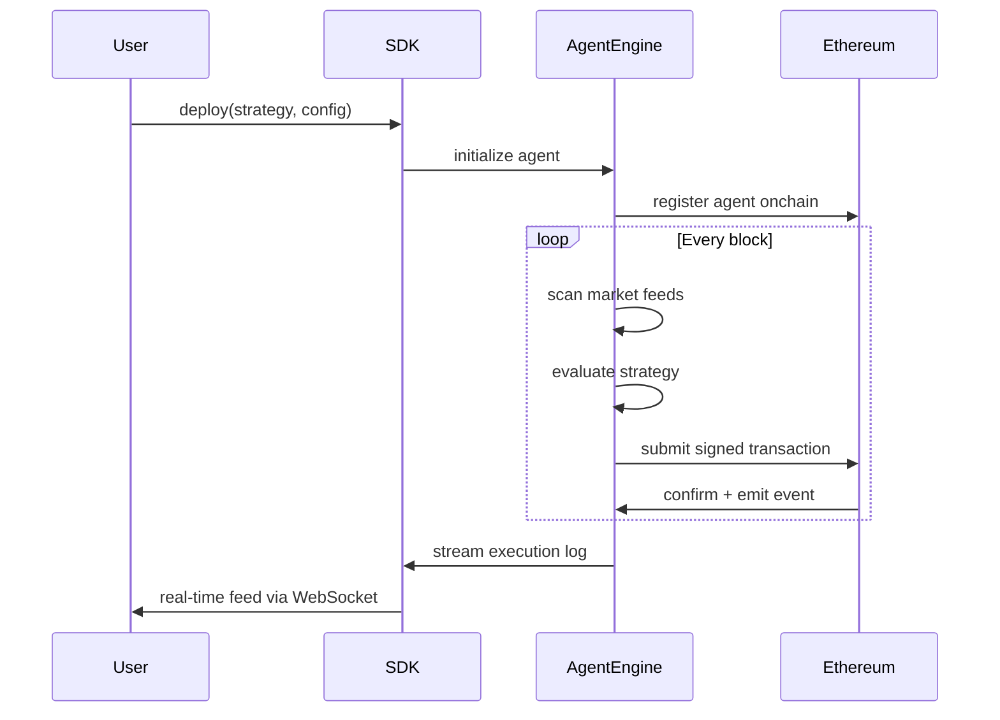

# NEXUS

Autonomous AI agent infrastructure for Ethereum. NEXUS enables developers and traders to deploy intelligent agents that execute DeFi strategies onchain with full verifiability and self-custodial guarantees.

[](LICENSE)
[](https://ethereum.org)
[]()

> **This project is in active development.** The SDK, API, and smart contracts are not yet deployed or published. This repository contains the protocol design and initial implementation.

---

## Overview

```
┌─────────────────────────────────────────────────────────────┐
│                         NEXUS                               │
│                                                             │
│   User Intent          Agent Engine         Ethereum        │
│  ┌──────────┐         ┌──────────┐         ┌──────────┐    │
│  │ SDK /    │ deploy  │ Strategy │ signed  │ Smart    │    │
│  │ REST API │────────>│ Runtime  │────────>│ Contract │    │
│  └──────────┘         └────┬─────┘         └──────────┘    │
│                            │                     │          │
│                       ┌────▼─────┐         ┌────▼─────┐    │
│                       │ Market   │         │ On-Chain │    │
│                       │ Feed     │         │ Verifier │    │
│                       └──────────┘         └──────────┘    │
└─────────────────────────────────────────────────────────────┘
```

### How it works



---

## Packages

| Package | Description | Status |
|---|---|---|
| [`@nexus/sdk`](packages/sdk) | TypeScript SDK for deploying and managing agents | In development |
| [`@nexus/core`](packages/core) | Core agent engine and strategy runtime | In development |

---

## Agent types

| Agent | Strategy | Description |
|---|---|---|
| `yield_optimizer` | Passive | Scans Uniswap, Aave, Lido pools and routes capital to highest APY |
| `arb_trader` | Active | Executes MEV-protected arbitrage across DEXs via Flashbots |
| `lp_manager` | Passive | Manages concentrated Uniswap v3 liquidity positions |
| `sentinel` | Guard | Monitors liquidation thresholds and auto-deleverages |

---

## Architecture

See [docs/architecture.md](docs/architecture.md) for full system design.

---

## Documentation

- [Architecture](docs/architecture.md)
- [Agent Types](docs/agents.md)
- [API Reference](docs/api-reference.md)
- [Security](docs/security.md)
- [Contributing](CONTRIBUTING.md)

---

## Links

- Website: [nxsagents.io](https://nxsagents.io)
- Twitter / X: [@NXSAgents](https://x.com/NXSAgents)

---

## License

MIT
