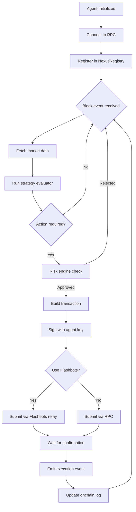

# Architecture

## System Overview

NEXUS is composed of four layers: the client interface, the agent engine, the on-chain verification layer, and the market data layer.

```
┌──────────────────────────────────────────────────────────────────┐
│  CLIENT LAYER                                                    │
│  TypeScript SDK / REST API / WebSocket Feed                      │
└───────────────────────────┬──────────────────────────────────────┘
                            │
┌───────────────────────────▼──────────────────────────────────────┐
│  AGENT ENGINE                                                    │
│                                                                  │
│  ┌─────────────┐  ┌─────────────┐  ┌─────────────┐             │
│  │  Strategy   │  │    Risk     │  │  Execution  │             │
│  │  Evaluator  │  │   Engine    │  │   Queue     │             │
│  └──────┬──────┘  └──────┬──────┘  └──────┬──────┘             │
│         └────────────────┴─────────────────┘                    │
│                           │                                      │
│  ┌────────────────────────▼─────────────────────────────────┐   │
│  │  Transaction Builder + Flashbots Relay                   │   │
│  └──────────────────────────────────────────────────────────┘   │
└───────────────────────────┬──────────────────────────────────────┘
                            │
┌───────────────────────────▼──────────────────────────────────────┐
│  ON-CHAIN LAYER                                                  │
│                                                                  │
│  NexusRegistry.sol     AgentVault.sol     OnchainVerifier.sol    │
│  (agent registration)  (asset custody)   (proof validation)     │
└───────────────────────────┬──────────────────────────────────────┘
                            │
┌───────────────────────────▼──────────────────────────────────────┐
│  MARKET DATA LAYER                                               │
│  Uniswap v3 / Aave v3 / Lido / Chainlink / Alchemy              │
└──────────────────────────────────────────────────────────────────┘
```

---

## Agent Execution Flow



---

## On-Chain Verification

Every agent action is recorded and verifiable on Ethereum. The verification flow works as follows:

```
Agent Action
    │
    ▼
AgentVault.sol
    │  emits ActionProposed(agentId, actionHash, timestamp)
    ▼
OnchainVerifier.sol
    │  verifies signature matches registered agent key
    │  checks action hash against strategy constraints
    ▼
ActionExecuted(agentId, txHash, block, result)
    │
    ▼
Immutable on Ethereum
```

---

## Self-Custody Model

Agents never hold custody of user funds directly. The model works as follows:

1. User deposits into `AgentVault.sol` with signed spending limits
2. Agent calls vault with signed action approvals
3. Vault validates signature and executes transfer
4. User can withdraw at any time without agent involvement

No private keys are ever shared with the NEXUS infrastructure.

---

## Network Topology

```
                    ┌─────────────┐
                    │  Alchemy    │
                    │  RPC Node   │
                    └──────┬──────┘
                           │
         ┌─────────────────┼─────────────────┐
         │                 │                 │
    ┌────▼────┐       ┌────▼────┐       ┌────▼────┐
    │ Agent   │       │ Agent   │       │ Agent   │
    │ #4821   │       │ #0039   │       │ #7741   │
    └────┬────┘       └────┬────┘       └────┬────┘
         │                 │                 │
         └─────────────────┼─────────────────┘
                           │
                    ┌──────▼──────┐
                    │  Flashbots  │
                    │  Relay      │
                    └──────┬──────┘
                           │
                    ┌──────▼──────┐
                    │  Ethereum   │
                    │  Mainnet    │
                    └─────────────┘
```
